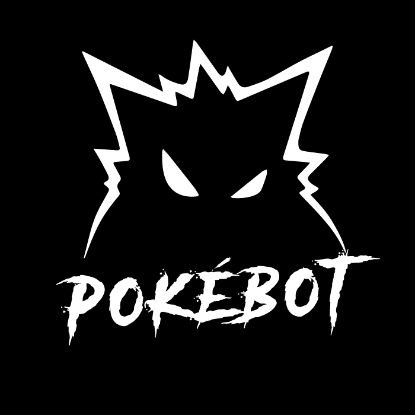

   
  

    
  

    
  

    
     
    
    
    
    
    
  

## About

Pokébot is a [Node.js](https://nodejs.org) module using [Discord.js](https://github.com/discordjs/discord.js) that allows you to easily add a bot for Pokémon RP server on [Discord](https://discord.com).

- Ultra basic commands
- Easily customisable commands
- WIP !

https://github.com/Joffrey-Parisot/pokebot/workflows/.github/workflows/main.yml/badge.svg